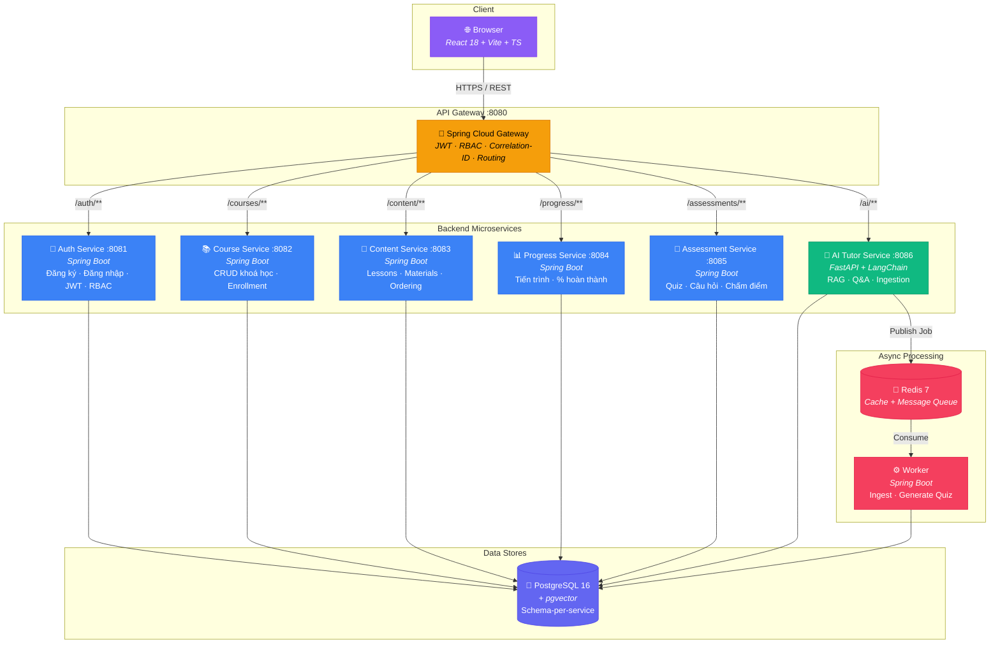
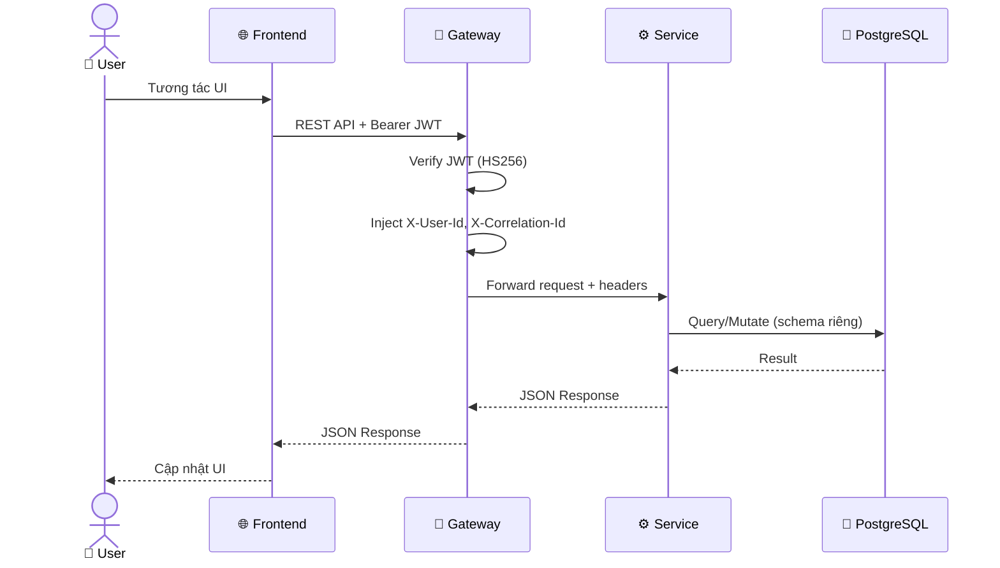

# 📚 SageLMS — AI-Powered Learning Management System

[](https://github.com/daithang59/sagelms/actions/workflows/ci-pr.yml)

> **Vision:** Xây dựng nền tảng học trực tuyến thế hệ mới tích hợp AI Tutor, hỗ trợ cá nhân hoá lộ trình học và đánh giá tự động.

📖 [Onboarding](./docs/onboarding.md) · 🏗 [Architecture](./docs/architecture/overview.md) · 📋 [Roadmap](./docs/roadmap.md) · 🤝 [Contributing](./CONTRIBUTING.md) · 📜 [API Contracts](./contracts/)
[](https://sonarcloud.io/summary/new_code?id=daithang59_sagelms)
---

## 🎯 MVP Scope

| Feature | Mô tả |
|---------|--------|
| **Authentication** | Đăng ký / Đăng nhập (JWT + OAuth 2.0) |
| **Course Management** | CRUD khoá học, gán giảng viên |
| **Content Delivery** | Upload & phát video/tài liệu bài giảng |
| **Progress Tracking** | Theo dõi tiến trình học của sinh viên |
| **Assessment** | Tạo bài kiểm tra, chấm điểm tự động |
| **AI Tutor** | Chatbot hỗ trợ hỏi đáp dựa trên nội dung khoá học |

---

## 🛠 Tech Stack

| Layer | Công nghệ |
|-------|-----------|
| **Frontend** | React 18, Vite, TypeScript, Tailwind CSS 3, React Router 6 |
| **Core Backend** | Spring Boot 3.x, Java 17 |
| **AI Tutor** | FastAPI, Python 3.11, LangChain |
| **API Gateway** | Spring Cloud Gateway |
| **Database** | PostgreSQL 16 + pgvector |
| **Cache / Queue** | Redis 7 |
| **Migration** | Flyway (Java), Alembic (Python) |
| **Auth** | Spring Security + JWT |
| **Testing** | JUnit 5 + Mockito (Java), Vitest (Frontend) |
| **Infra** | Docker Compose (local), Kubernetes (staging) |

---

## 🏗 Kiến trúc Microservices

### Sơ đồ tổng quan



### Luồng xử lý Request



### Cấu trúc thư mục

```
apps/web               → Frontend (React 18 + Vite)
services/gateway        → API Gateway (Spring Cloud Gateway)
services/auth-service   → Xác thực & phân quyền (Spring Boot)
services/course-service → Quản lý khoá học (Spring Boot)
services/content-service→ Quản lý nội dung (Spring Boot)
services/progress-service→ Theo dõi tiến trình (Spring Boot)
services/assessment-service → Đánh giá / kiểm tra (Spring Boot)
services/ai-tutor-service   → AI Tutor chatbot (FastAPI + LangChain)
services/worker         → Background jobs (Spring Boot / Redis consumer)
infra/docker            → Docker Compose cho local dev
infra/k8s               → Kubernetes manifests
```

---

## 🚀 Chạy Local bằng Docker Compose

### Yêu cầu
- Docker ≥ 24.x & Docker Compose v2
- JDK 17+, Node.js 20+, Python 3.11+ (cho ai-tutor)

### Bước chạy

```bash
# 1. Clone repo
git clone https://github.com/daithang59/sagelms.git
cd sagelms

# 2. Copy env mẫu
cp .env.example .env          # chỉnh lại giá trị phù hợp

# 3. Khởi chạy toàn bộ stack
docker compose -f infra/docker/docker-compose.yml up -d

# 4. Truy cập
#    - Web UI:      http://localhost:3000
#    - API Gateway:  http://localhost:8080
#    - pgAdmin:      http://localhost:5050
```

---

## 🔌 Danh sách Services & Ports

| Service | Port | Tech |
|---------|------|------|
| Web (Frontend) | `3000` | React 18 + Vite |
| API Gateway | `8080` | Spring Cloud Gateway |
| Auth Service | `8081` | Spring Boot 3.x |
| Course Service | `8082` | Spring Boot 3.x |
| Content Service | `8083` | Spring Boot 3.x |
| Progress Service | `8084` | Spring Boot 3.x |
| Assessment Service | `8085` | Spring Boot 3.x |
| AI Tutor Service | `8086` | FastAPI + LangChain |
| Worker | `—` | Spring Boot (Redis consumer) |
| PostgreSQL | `5432` | PostgreSQL 16 + pgvector |
| Redis | `6379` | Redis 7 |

---

## 🌿 Quy ước Branch & PR

| Loại | Prefix | Ví dụ |
|------|--------|-------|
| Feature | `feat/` | `feat/add-course-crud` |
| Bug fix | `fix/` | `fix/login-token-expired` |
| Chore | `chore/` | `chore/update-deps` |
| Docs | `docs/` | `docs/add-api-spec` |
| Hotfix | `hotfix/` | `hotfix/critical-auth-bug` |

**Quy trình:**
1. Tạo branch từ `develop` (hoặc `main` cho hotfix).
2. Commit theo [Conventional Commits](https://www.conventionalcommits.org/).
3. Mở PR → Ít nhất 1 approval + CI xanh → Merge.

> Chi tiết xem [CONTRIBUTING.md](./CONTRIBUTING.md).

---

## 👥 Danh sách thành viên

- **Huỳnh Lê Đại Thắng** - Leader
- **Trần Nguyễn Việt Hoàng** - Member
- **Bùi Ngọc Thái** - Member
- **Nguyễn Trường Duy** - Member

---

## 📄 License

[MIT](./LICENSE)
